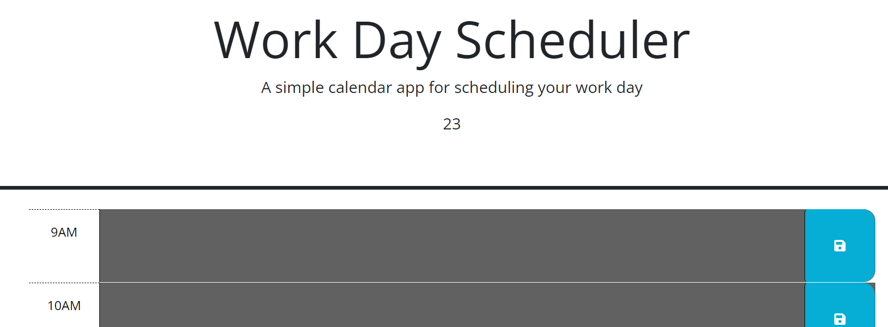

# Busy.Bee.Schedule
## An application that allows the user to click into time slots and write events inside to create an hourly schedule

A password generator that will take the user through a series of prompts, including length, and character types desired, in order to create an ideal password.  The user must stay within certain parameters or else an alert will pop up. Once the choices are made within the parameters, a password will show up on the screen.

## Screenshots

## [liveURL](https://rachaelkstokes.github.io/Busy.Bee.Schedule/)